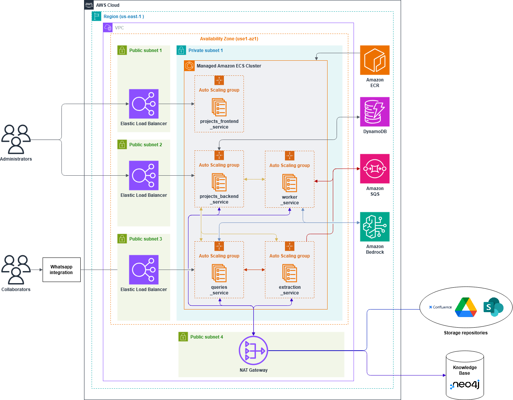

# LEXI: Documentation Management System and Conversational Assistant for Engineering Projects

## Description

In engineering projects, interdisciplinary collaboration generates large volumes of information, presenting significant challenges in managing, consulting, and drafting documents. This system addresses these issues through a microservices-based solution that centralizes project documentation and enables interaction with it via an intelligent conversational assistant.

The solution integrates Retrieval-Augmented Generation (RAG) techniques, semantic search, and learning from collaborator interactions. This ensures a reliable, traceable, and constantly evolving knowledge base while improving accessibility and efficiency in obtaining information.

---

## Key Features

### 1. **REST API for Project Management**
- Manages projects, storage repositories, and collaborator access roles.
- Differentiated access points:
  - Frontend: user authentication with JWT tokens.
  - Backend: API key-based authentication.
- **DynamoDB** as a NoSQL database for administrative storage, ensuring flexibility, scalability, and high performance.

### 2. **Project Administration Interface**
- Built with **ReactJS** to provide an attractive and intuitive experience.
- Allows administrators to manage repositories, permissions, and integration with the conversational assistant.
- Designed to simplify project configuration and promote adoption.

### 3. **Collection and Processing Service**
- Collects documents from selected repositories (e.g., Google Drive).
- Processes, cleans, and segments documents, extracting metadata such as authorship and dates.
- Processes segments into embeddings for semantic search capabilities.
- Task management through **Amazon SQS** and concurrent processing with **Celery**, ensuring scalability and parallelism.
- Learning workflow based on conversations with collaborators, identifying intents and generating updated knowledge.

---

## Processing Workflow

1. **Document Collection**
   - Validation of storage repositories.
   - Extraction of new or updated documents since the last synchronization.
   - Document segmentation into paragraphs and embedding generation for semantic searches.

2. **Storage and Queries**
   - Processed documents are stored as nodes in the knowledge base.
   - Queries to the assistant cite the sources used to ensure reliability and traceability.

3. **Learning from Conversations**
   - Interaction analysis to identify relevant information.
   - Intent classification and synthesis of higher-level knowledge.
   - Knowledge base updates without modifying model parameters.

---

## System Architecture

Below is a visual representation of the system architecture:

---

## Key Technologies

- **ReactJS**: Frontend user interface development.
- **DynamoDB**: NoSQL storage for administrative data.
- **Amazon SQS**: Message broker for asynchronous tasks.
- **Celery**: Concurrent task processing.
- **Docker Compose**: Container management for API, workers, and brokers.
- **Google Drive**: Integrated storage repository in the initial version.

---

## Benefits

- Centralized documentation to ensure accessibility and constant updates.
- Reduced misunderstandings and redundant queries in interdisciplinary projects.
- Scalability and adaptability to new requirements.
- Intuitive and reliable user experience, fostering adoption among engineering teams.

---

## Academic Contributions

This solution was presented at **CACIC** (Argentine Congress of Computer Science) and **CoNaIISI** (National Congress of Research in Software Engineering and Information Systems), two of the most important software-related conferences in Argentina. 

We published a paper in each of these events, highlighting the innovative aspects and practical applications of this solution. Both papers received positive feedback for addressing critical challenges in knowledge management for engineering projects. Validation with end-users confirmed the effectiveness of the proposal and its alignment with the needs of the sector.

