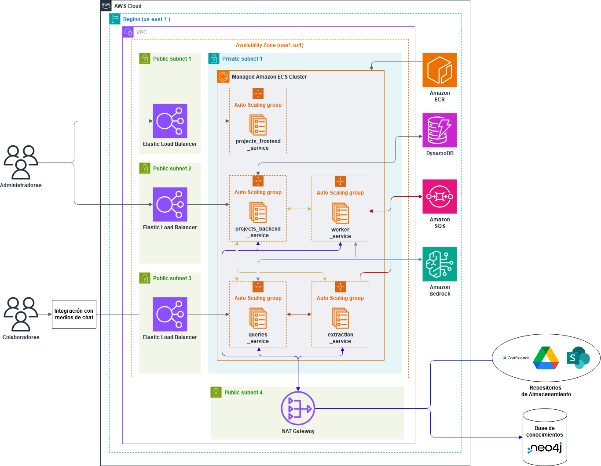

# LEXI: Sistema de Gestión de Documentación y Asistente Conversacional para Proyectos de Ingeniería

## Descripción

En los proyectos de ingeniería, la colaboración interdisciplinaria genera grandes volúmenes de información, lo que plantea desafíos importantes en la gestión, consulta y redacción de documentos. Este sistema aborda estas problemáticas mediante una solución basada en microservicios que centraliza la documentación del proyecto y permite interactuar con ella a través de un asistente conversacional inteligente.

La solución integra técnicas de Generación Aumentada por Recuperación (RAG), búsqueda semántica y aprendizaje a partir de interacciones con los colaboradores. Esto garantiza una base de conocimiento confiable, trazable y en constante evolución, mientras mejora la accesibilidad y la eficiencia en la obtención de información.

---

## Características Principales

### 1. **API REST para la Gestión de Proyectos**
- Gestión de proyectos, repositorios de almacenamiento y roles de acceso de colaboradores.
- Puntos de entrada diferenciados:
  - Frontend: autenticación con usuario y contraseña para generar JSON Web Tokens (JWT).
  - Backend: autenticación mediante API keys.
- Uso de **DynamoDB** como base de datos NoSQL para el almacenamiento administrativo, garantizando flexibilidad, escalabilidad y alto rendimiento.

### 2. **Interfaz de Administración de Proyectos**
- Construida con **ReactJS** para brindar una experiencia atractiva e intuitiva.
- Permite a los administradores gestionar repositorios, permisos y la integración con el asistente conversacional.
- Diseñada para facilitar la configuración de proyectos y fomentar su adopción.

### 3. **Servicio de Recolección y Procesamiento**
- Recolecta documentos desde repositorios seleccionados (ejemplo: Google Drive).
- Procesa, limpia y segmenta documentos, extrayendo metadatos como autoría y fechas.
- Segmentos procesados se incrustan en una base de conocimientos para habilitar búsquedas semánticas.
- Manejo de tareas mediante **Amazon SQS** y procesamiento concurrente con **Celery** para garantizar escalabilidad y paralelismo.
- Flujo de aprendizaje basado en las conversaciones con colaboradores, identificando intenciones y generando conocimiento actualizado.

---

## Flujo de Procesamiento

1. **Recolección de Documentos**
   - Validación de repositorios de almacenamiento.
   - Extracción de documentos nuevos o actualizados desde la última sincronización.
   - Segmentación de documentos en párrafos e incrustación para búsquedas semánticas.

2. **Almacenamiento y Consultas**
   - Documentos procesados se almacenan como nodos en la base de conocimientos.
   - Las consultas realizadas al asistente citan las fuentes utilizadas para asegurar confiabilidad y trazabilidad.

3. **Aprendizaje a partir de Conversaciones**
   - Análisis de las interacciones para identificar información relevante.
   - Clasificación de intenciones y síntesis de conocimientos más elevados.
   - Actualización de la base de conocimientos sin modificar los parámetros del modelo.

---

## Arquitectura del Sistema

A continuación se presenta una representación visual de la arquitectura del sistema:

---

## Tecnologías Principales

- **ReactJS**: Desarrollo de interfaces gráficas.
- **DynamoDB**: Almacenamiento NoSQL para datos administrativos.
- **Amazon SQS**: Broker de mensajería para tareas asincrónicas.
- **Celery**: Procesamiento concurrente de tareas.
- **Docker Compose**: Gestión de contenedores para API, workers y brokers.
- **Google Drive**: Repositorio de almacenamiento integrado en la primera versión.

---

## Beneficios

- Centralización de documentación para garantizar accesibilidad y actualización constante.
- Reducción de malentendidos y consultas redundantes en proyectos interdisciplinarios.
- Escalabilidad y adaptabilidad a nuevas necesidades.
- Experiencia de usuario intuitiva y confiable, fomentando la adopción en equipos de ingeniería.

---

## Contribuciones Académicas

Esta solución fue presentada en **CACIC** (Congreso Argentino de Ciencias de la Computación) y **CoNaIISI** (Congreso Nacional de Investigación en Ingeniería de Software y Sistemas de Información), dos de los congresos más importantes relacionados con software en Argentina.

Publicamos un artículo en cada uno de estos eventos, destacando los aspectos innovadores y las aplicaciones prácticas de esta solución. Ambos trabajos recibieron comentarios positivos por abordar desafíos críticos en la gestión del conocimiento para proyectos de ingeniería. La validación con usuarios finales confirmó la efectividad de la propuesta y su alineación con las necesidades del sector.

